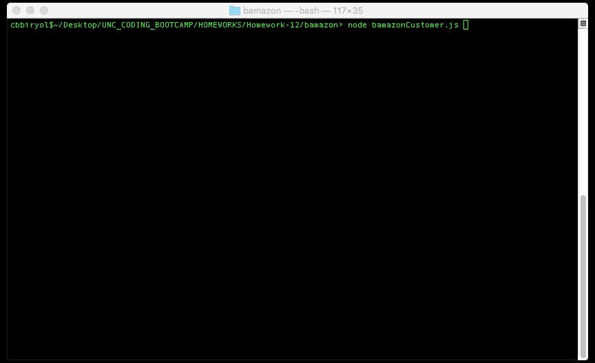
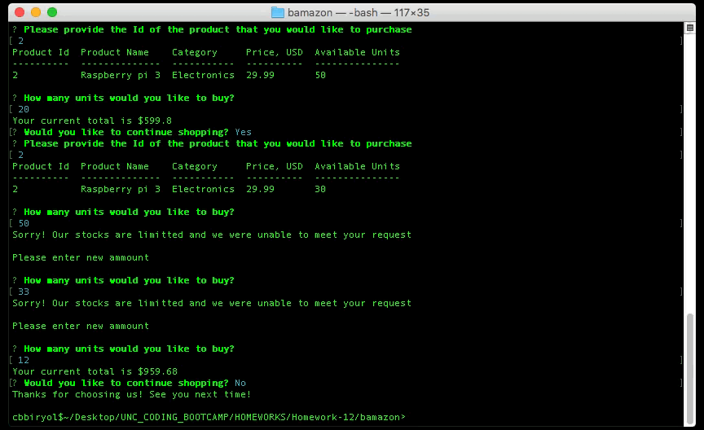
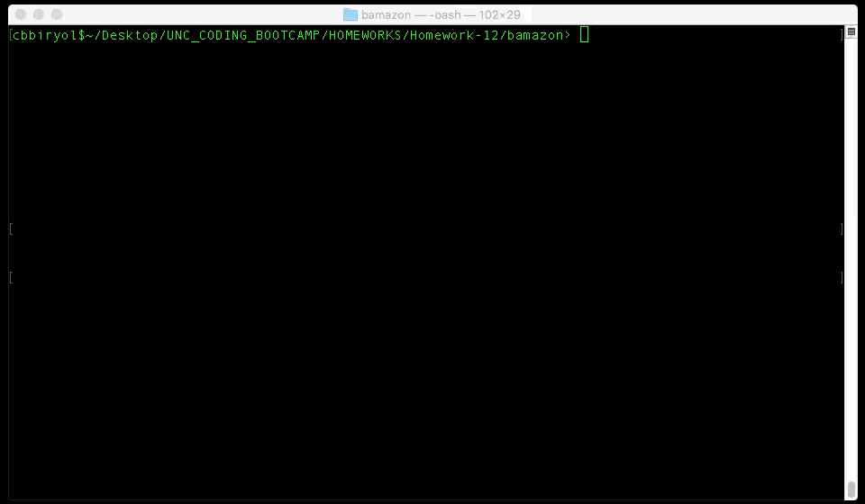

# bamazon
### USAGE:

```node bamazonCustomer.js```

OR

```node bamazonManager.js ```

### DEPENDENCIES & TECHNOLOGIES USED:
Following node modules are required
* `mysql`
* `inquirer`
* `easy-table`

## SUMMARY:
This is a cli based E-commerce app that utilises `mySQL`. The app comprises 3 functionalities. 
* The first fuctionality ( `bamazonCustomer.js` ) allows user to buy merchandise from a list of products stored in a `mySQL` database with schema file `bamazon.sql`. The user specifies 2 pieces of information:
    * a product id based on the table output of products in database,
    * desired quantity of the product. 
* The second functionality ( `bamazonManager.js`) allows management of the database and the products via `mySQL`  `CRUD` functions. In this mode the user can do the following:
    * display the existing list of products
    * display products with low inventory
    * replenish inventory for a given product
    * add new product to list of producst
* The third functionality ( `bamazonSupervisor.js`) allows financial analysis of the sales performance of each department. This utility also allows for addition of new departments using `mySQL` `CRUD` functions. In this mode the user can do the following:
    * display the existing departments, their total sales and the profit for that department given an overhead cost.
    * Add a new department and an overhead cost for it to the database


### HOW IT WORKS:
Here is how it works in **customer mode**


Here is how it works in **manager mode**


Here is how it works in **manager mode**
